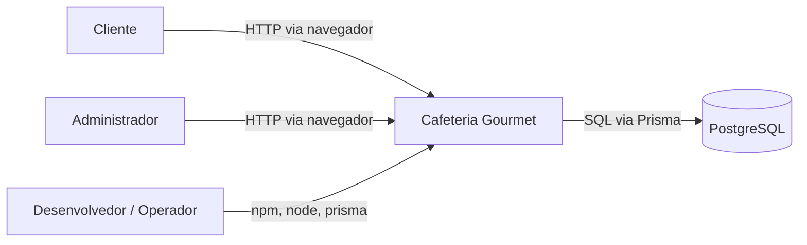
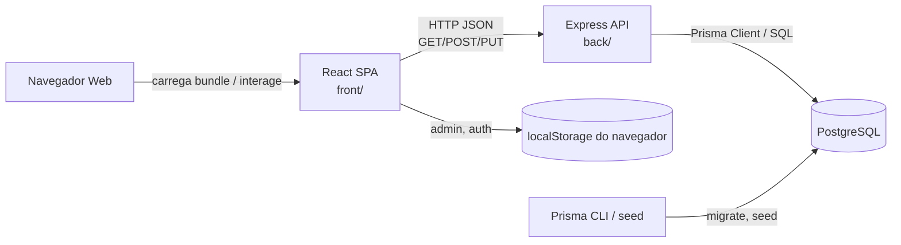
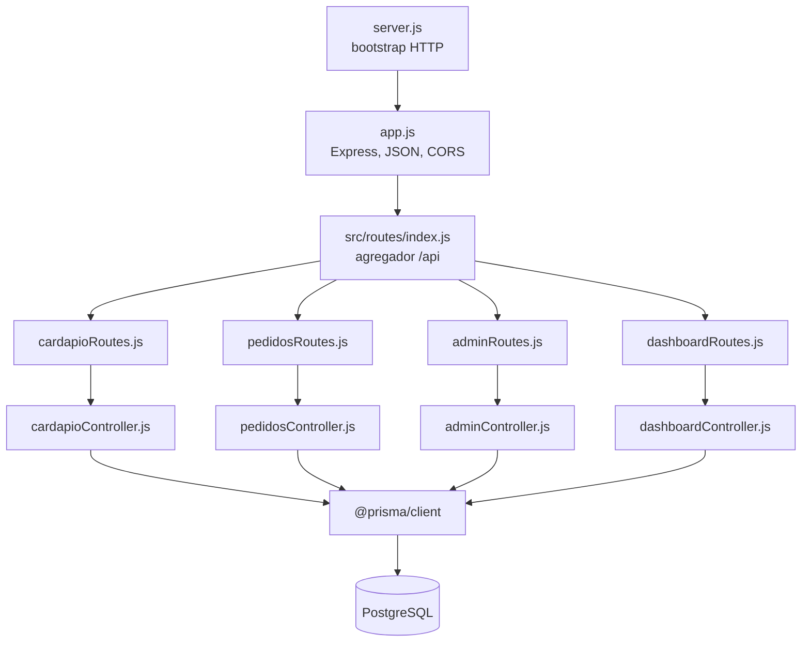
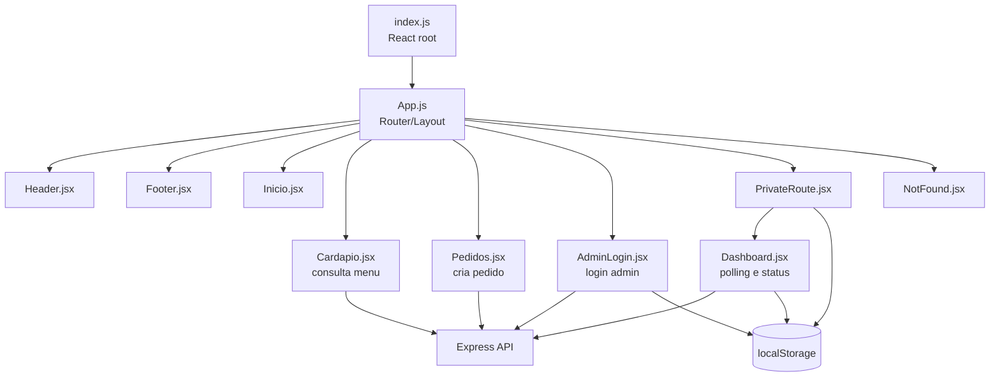

# Architectural Design Document - Cafeteria Gourmet

**Projeto:** Estudos Especiais - Cafe Gourmet  
**Tipo:** ADD/SAD por engenharia reversa  
**Data:** 2026-05-30  
**Escopo C4:** nivel 1 System Context, nivel 2 Containers, nivel 3 Components  
**Estado descrito:** arquitetura AS-IS observada no repositorio local

## 1. Introducao

### Escopo e proposito

Este documento descreve a arquitetura atual da aplicacao web Cafeteria Gourmet, um sistema full stack para exibicao de cardapio, criacao de pedidos e acompanhamento administrativo de pedidos de uma cafeteria.

O objetivo e documentar a arquitetura existente por engenharia reversa, sem esconder inconsistencias, codigo morto ou decisoes cujo motivo nao esta registrado. Este ADD cobre:

- contexto do sistema;
- containers executaveis e infraestrutura de dados;
- componentes internos principais;
- fluxos runtime principais;
- decisoes arquiteturais observadas;
- riscos e debitos tecnicos;
- contrato REST documentado em OpenAPI.

### Referencias

- `README.md`: visao geral, tecnologias, execucao local e credenciais seed.
- `docs/Catalogo_ICs_Repositorios.md`: catalogo de itens de configuracao e repositorios.
- `docs/ConfigurationItens.md`: itens de configuracao versionados.
- `itens_configuracao.md`: lista adicional de itens de configuracao.
- `docs/architecture/01-static-inventory.md`: inventario estatico.
- `docs/architecture/02-internal-dependency-map.md`: grafo de dependencias internas.
- `docs/architecture/03-runtime-behavior.md`: fluxos e comportamento runtime.
- `docs/architecture/04-adr-drafts.md`: ADRs rascunho.
- `docs/openapi.yaml`: OpenAPI Specification da API backend.

Nao foi encontrado um SRS ou SDD formal alem dos documentos de configuracao e do README.

## 2. Contexto do Sistema

### O que o sistema faz

O Cafeteria Gourmet permite que clientes consultem o cardapio, montem pedidos com retirada ou entrega e enviem esses pedidos para persistencia. Administradores fazem login e acompanham pedidos em um painel, podendo marcar pedidos como concluídos ou cancelados.

### Quem usa

| Ator | Uso principal |
|---|---|
| Cliente | Acessa a SPA, visualiza cardapio e cria pedidos |
| Administrador | Realiza login e acompanha/atualiza status de pedidos |
| Equipe de desenvolvimento/operacao | Executa seed, migrations, backend e frontend localmente |

### Sistemas externos

| Sistema externo | Relacao |
|---|---|
| PostgreSQL | Banco de dados persistente acessado via Prisma |
| Navegador web | Ambiente de execucao da SPA e armazenamento `localStorage` |
| Runtime Node.js | Executa a API Express, seed Prisma e scripts |

### C4 nivel 1 - System Context

## 3. Containers

### C4 nivel 2 - Container diagram

### Containers e comunicacao

| Container | Processo/artefato | Responsabilidade | Protocolos/dados |
|---|---|---|---|
| React SPA | `front/src/index.js` via `react-scripts start/build` | Interface publica e administrativa | HTML/CSS/JS no navegador; HTTP JSON para API; `localStorage` |
| Express API | `back/server.js` | API REST, validacoes basicas e orquestracao Prisma | HTTP JSON em `/api/*`; CORS habilitado |
| PostgreSQL | configurado por `DATABASE_URL` | Persistencia de cardapio, pedidos e administradores | SQL emitido pelo Prisma |
| Prisma schema/migrations | `back/prisma/*` | Modelo de dados, migrations e seed | Prisma CLI, SQL e client gerado |

### Contratos de comunicacao

- Frontend para backend: HTTP JSON.
- Backend para banco: Prisma Client sobre conexao PostgreSQL.
- Login administrativo: resposta JSON com `admin.id` e `admin.email`; nao ha token.
- Dashboard: polling de pedidos a cada 5 segundos.
- OpenAPI: o contrato REST esta em `docs/openapi.yaml`.

## 4. Componentes

### Backend - C4 nivel 3

| Componente | Responsabilidade | Interface |
|---|---|---|
| `server.js` | Iniciar servidor na porta configurada | Processo Node; `PORT` |
| `app.js` | Criar app Express, habilitar JSON/CORS e montar `/api` | Express middleware |
| `routes/index.js` | Roteador raiz da API | `router.use('/cardapio'...)` |
| Rotas de recurso | Mapear metodo/caminho para controller | Express Router |
| Controllers | Validar parcialmente, executar regra simples, chamar Prisma e responder HTTP | `req`, `res`, Prisma Client |
| Prisma schema | Definir modelos persistentes | `Cardapio`, `Pedido`, `Administrador` |

### Frontend - C4 nivel 3

| Componente | Responsabilidade | Interface |
|---|---|---|
| `index.js` | Montagem da SPA | DOM `#root` |
| `App.js` | Roteamento e layout global | React Router |
| `Header`/`Footer` | Navegacao e rodape em rotas publicas | Props implicitas/links |
| `Cardapio.jsx` | Busca cardapio, agrupa por categoria e renderiza abas | `GET /api/cardapio` |
| `Pedidos.jsx` | Monta pedido, valida formulario e envia para API | `GET /api/cardapio`, `POST /api/pedidos` |
| `AdminLogin.jsx` | Autentica admin e grava estado local | `POST /api/admin/login`, `localStorage` |
| `PrivateRoute.jsx` | Protecao client-side de rota administrativa | `localStorage.admin` |
| `Dashboard.jsx` | Lista pedidos por status e atualiza status | `GET /api/dashboard`, `PUT /api/dashboard/{id}` |

### Modelo de dados

| Modelo | Campos principais | Uso |
|---|---|---|
| `Cardapio` | `id`, `nome`, `preco`, `categoria`, `criadoEm` | Itens exibidos no cardapio e usados na montagem de pedidos |
| `Pedido` | `id`, `nomeCliente`, `itens`, `precoTotal`, pagamento, entrega, troco, `status`, `criadoEm` | Pedido criado por cliente e acompanhado no dashboard |
| `Administrador` | `id`, `email`, `senha`, `criadoEm` | Login administrativo |

## 5. Fluxos runtime principais

Os sequence diagrams completos estao em `docs/architecture/03-runtime-behavior.md`. Os fluxos principais sao:

| Fluxo | Entrada | Saida |
|---|---|---|
| Consultar cardapio | `GET /api/cardapio` disparado por `Cardapio.jsx` ou `Pedidos.jsx` | Lista JSON de itens `Cardapio` |
| Criar pedido | `POST /api/pedidos` disparado por `Pedidos.jsx` | Pedido persistido com `precoTotal` calculado |
| Login admin | `POST /api/admin/login` disparado por `AdminLogin.jsx` | Dados basicos do admin em JSON e gravação no `localStorage` |
| Acompanhar dashboard | `GET /api/dashboard` a cada 5 segundos | Lista de pedidos ordenada por `criadoEm desc` |
| Atualizar status | `PUT /api/dashboard/{id}` | Pedido atualizado com novo `status` |

## 6. Decisoes Arquiteturais

As decisoes abaixo estao documentadas como ADRs rascunho em `docs/architecture/04-adr-drafts.md`.

| ADR | Decisao | Status do motivo |
|---|---|---|
| ADR-001 | Usar React SPA para interface web | Desconhecido |
| ADR-002 | Usar API Express sob prefixo `/api` | Parcialmente inferido |
| ADR-003 | Organizar backend em rotas e controllers | Observado |
| ADR-004 | Usar Prisma com PostgreSQL | Desconhecido |
| ADR-005 | Instanciar PrismaClient diretamente em cada controller | Desconhecido |
| ADR-006 | Proteger dashboard por `localStorage`, sem token de API | Desconhecido |
| ADR-007 | Usar polling de 5 segundos no dashboard | Inferido como simplicidade |
| ADR-008 | Manter categorias do cardapio hard-coded no frontend | Desconhecido |
| ADR-009 | Misturar `axios` e `fetch` | Desconhecido |
| ADR-010 | Usar URLs locais hard-coded no frontend | Desconhecido |

## 7. Riscos e Debitos Tecnicos

### Ciclos de dependencia

Nao foram encontrados ciclos diretos entre modulos. O grafo e majoritariamente unidirecional: bootstrap -> app -> rotas -> controllers -> Prisma.

### Acoplamentos problematicos

| Risco/debito | Impacto |
|---|---|
| Controllers criam `PrismaClient` diretamente | Aumenta acoplamento com persistencia, dificulta testes e pode multiplicar conexoes |
| `back/prismaClient.js` nao e usado | Indica intencao arquitetural abandonada ou inconsistente |
| Autenticacao apenas por `localStorage` | Endpoints administrativos ficam desprotegidos no backend |
| Senhas em texto claro | Risco critico de seguranca e compliance |
| Logs de email/senha no login | Risco de vazamento de credenciais |
| Logout remove `auth`, mas `PrivateRoute` verifica `admin` | Usuario pode permanecer com acesso ao dashboard apos logout |
| URLs de API hard-coded | Dificulta deploy e troca de ambiente |
| Dashboard usa `localhost:3000` e outras telas usam `localhost:4000` | Comportamento depende do proxy CRA em desenvolvimento |
| Contrato de itens divergente (`nome/quantidade` vs `name/quantity`) | Itens podem aparecer vazios no dashboard |
| `dashboardController.createPedido` usa `numeroMesa`, ausente no schema atual | Codigo morto/desalinhado que falharia se exposto |
| Categorias hard-coded no frontend | Novas categorias no banco nao aparecem automaticamente |
| Validacao de API limitada | Payloads invalidos podem chegar ao banco ou falhar com erro 500 |

### Areas sem cobertura de testes

- Backend nao possui testes automatizados declarados; `back/package.json` tem script de teste que retorna erro.
- Controllers, rotas, Prisma/migrations e fluxos de erro nao possuem cobertura observada.
- Frontend possui `App.test.js` inicial do CRA procurando "learn react", desalinhado com a interface atual.
- Nao ha testes de integracao entre frontend e API.
- Nao ha testes end-to-end dos fluxos de pedido, login e dashboard.

### Riscos operacionais

- A porta padrao do backend e `4000`, mas parte do frontend chama `3000/api`.
- O `.env.example` do frontend declara `REACT_APP_API_URL`, mas o codigo nao a utiliza.
- O banco depende de `DATABASE_URL`; nao ha estrategia documentada de provisionamento do PostgreSQL fora da execucao local.
- O seed cria credenciais padrao `admin@admin.com` / `123`, inadequadas para ambiente real.

## 8. OpenAPI

A especificacao OpenAPI 3.0 da API backend foi escrita em:

`docs/openapi.yaml`

Ela documenta os endpoints expostos pelo roteamento atual:

- `GET /api/cardapio`
- `POST /api/cardapio`
- `PUT /api/cardapio/{id}`
- `DELETE /api/cardapio/{id}`
- `GET /api/pedidos`
- `POST /api/pedidos`
- `POST /api/admin/login`
- `GET /api/dashboard`
- `PUT /api/dashboard/{id}`

Funcoes existentes mas nao roteadas, como `pedidosController.deletePedido` e `dashboardController.createPedido`, nao foram incluidas como endpoints expostos.
